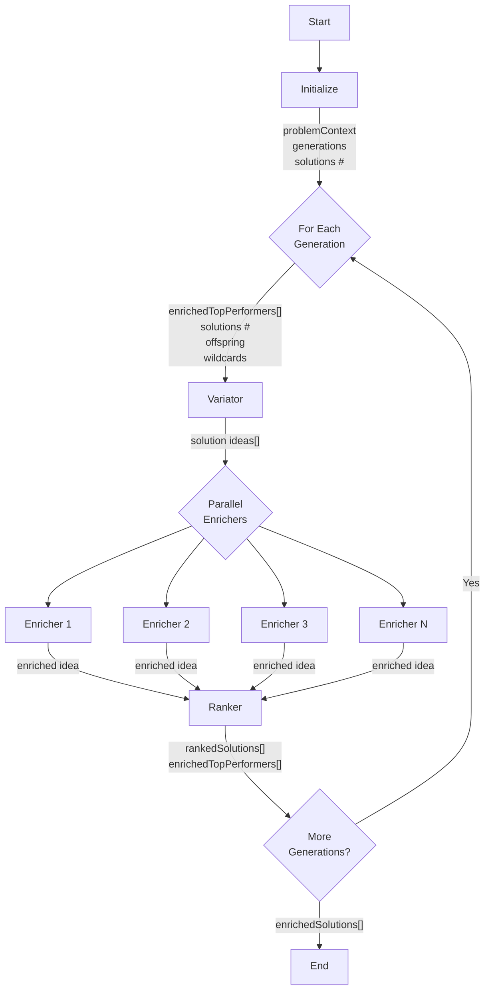

# Evolution Solver Microservice - Product Specification

  

## 1. Product Overview

  

### 1.1 Purpose

The Evolution Solver Microservice is an AI-powered business solution generator that uses evolutionary algorithms to create, refine, and optimize innovative business strategies. It leverages LLMs to evolve creative business solutions with detailed financial analysis for specific problems.

  

### 1.2 Core Value Proposition

-  **Ideas Generation**: Generate dozens of creative business solutions in minutes

-  **Business Case Development**: Each solution includes financial projections and implementation steps

-  **Risk Adjusted Ideas Ranking**: Balance risk, return, and capital requirements

-  **Evolutionary Refinement**: Ideas improve across generations through AI-driven evolutionary selection

### 1.3 Target Use Cases

Finding creative business ideas in growing industries.

  

## 2. Functional Specifications

  

### 2.1 Input Parameters

  

#### Required Parameters

```json

{

	"problemContext": "string", // Business problem or opportunity description

	"parameters": {

		"generations": 10, // Number of evolution cycles (1-20)

		"populationSize": 5  // Ideas per generation (3-10)

	}

}

```

  

#### Optional Parameters

```json

{

	"parameters": {

		"maxCapex": 50000, // Maximum capital in $M (default: 100B)
		"diversificationFactor": 0.05, // $50K for risk adjustment

		"minProfits": 100, // Minimum 5-year NPV in $M (default: none)

		"dealTypes": "creative partnerships and business models"  // Text describing preferred deal types

},

	"initialSolutions": [] // Seed ideas to start with

}

```

  

### 2.2 Output Structure

  

#### Top-Level Results

```json

{

	"jobId": "uuid",

	"status": "completed",

	"solutions": [ // Best solutions across all generations

		{

			"idea_id": "unique_identifier",

			"title": "Solution Title",

			"description": "Detailed business model description",

			"score": 9.2, // Risk-adjusted score

			"generation": 8, // Which generation produced this

			"business_case": { // Financial analysis

			"npv_success": 250.5, // 5-year NPV in $M

			"capex_est": 15.0, // Initial investment in $M

			"timeline_months": 18, // Time to revenue

			"likelihood": 0.7, // Success probability

			"risk_factors": [], // Key risks

			"yearly_cashflows": [ // 5-year projections in $M

				-15.0, 10.0, 45.0, 85.0, 125.0

			]

		}

		}

	],

	"generationHistory": [], // Performance metrics by generation

	"metadata": {

		"totalGenerations": 10,

		"totalSolutions": 50,

		"processingTime": 145.5, // Seconds

		"apiCalls": 30,

		"topScore": 9.2,

		"avgScore": 6.5

	}

}

```

  

## 3. Algorithm Logic Flow

  

### 3.1 Simplified Evolution Loop

  



  
  

### 3.2 Detailed Phase Logic

  

#### Variator Phase Logic

```javascript

async  function  variator(topPerformers, problemContext, config) {

	const  numNeeded  =  config.populationSize;

	const  offspringRatio  =  config.offspringRatio  ||  0.7;

	// First generation or no top performers - generate all wildcards

	if (!topPerformers  ||  topPerformers.length  ===  0) {

		return  await  llmClient.generateIdeas(problemContext, numNeeded, [], config);

	}

	// Calculate offspring vs wildcard split

	const  offspringCount  =  Math.floor(numNeeded  *  offspringRatio);

	const  wildcardCount  =  numNeeded  -  offspringCount;

	// Generate new ideas via LLM with both offspring and wildcards

	const  ideas  =  await  llmClient.generateIdeas(

		problemContext,

		numNeeded,

		topPerformers, // LLM will use these to create offspring

		{ ...config, offspringCount, wildcardCount }

	);

	return  ideas;

}

```

  

#### Enricher Phase Logic (Parallel)

```javascript

async  function  enricher(ideas, problemContext, config, jobId) {

	// Process each idea in parallel with individual enricher

	const  enrichmentPromises  =  ideas.map(async (idea) => {

		try {

			// Check cache first

			const  cacheKey  =  `${jobId}_${idea.idea_id}`;

			const  cachedResult  =  await  cache.get(cacheKey);

			if (cachedResult) {

				return  cachedResult;

			}

			// Each idea gets its own LLM call for detailed analysis

			const  enrichedIdea  =  await  llmClient.enrichIdea(idea, problemContext, config);

			// Cache the result

			await  cache.set(cacheKey, enrichedIdea);

			return  enrichedIdea;

		} catch (error) {

			// Failed enrichments return null and are filtered out

			return null;

		}

	});

	// Wait for all enrichments to complete

	const  enrichedIdeas  =  await  Promise.all(enrichmentPromises);

	// Filter out failed enrichments

	const  validIdeas  =  enrichedIdeas.filter(idea  =>  idea  !== null);

	// Fail job if too many enrichments failed

	if (validIdeas.length  <  ideas.length  *  0.5) {

		throw  new  Error('Too many enrichment failures');

	}

	return  validIdeas;

}

```

  

#### Ranker Phase Logic

```javascript

function  ranker(enrichedSolutions, config) {

	const  C0  =  config.diversificationUnit  ||  0.05; // Default $50K

	const  topPerformerRatio  =  config.topPerformerRatio  ||  0.3; // Default 30%

	// Calculate score for each solution

	const  scoredSolutions  =  enrichedSolutions.map(solution  => {

		const  bc  =  solution.business_case;

		// Expected value: probability-weighted NPV minus risk-adjusted capex

		const  expectedValue  =  bc.likelihood  *  bc.npv_success  -

		(1  -  bc.likelihood) *  bc.capex_est;

		// Diversification penalty: sqrt(capex/C0) favors capital efficiency

		const  diversificationPenalty  =  Math.sqrt(bc.capex_est  /  C0);

		// Risk-adjusted score

		const  score  =  expectedValue  /  diversificationPenalty;

		return { ...solution, score, expectedValue };

	});

	// Sort by score (highest first)

	scoredSolutions.sort((a, b) =>  b.score  -  a.score);

	// Select top performers for next generation

	const  topPerformerCount  =  Math.ceil(scoredSolutions.length  *  topPerformerRatio);

	const  topPerformers  =  scoredSolutions.slice(0, topPerformerCount);

	return {

		rankedSolutions:  scoredSolutions,

		topPerformers:  topPerformers

	};

}

```
  

## 4. LLM Prompts

  

**Note**: While the current implementation includes problemContext in the user prompt, a better design would place it in the system prompt to avoid repetition across generations.

  

### 4.1 Variator Prompts
  
Model: o3/other reasoning models
#### System Prompt (Recommended)

```

You are an expert in creative business solution generation.

  

Problem to solve: ${problemContext}

${guidanceText}

  

Focus on ${dealTypes}


Generate ${numNeeded} new solutions as JSON array:

- ${offspringCount} OFFSPRING: Combine and evolve the top performers

- ${wildcardCount} WILDCARDS: Completely fresh approaches

  

Each solution must have:

- "idea_id": unique identifier

- "description": Business model in plain terms

- "core_mechanism": How value is created and captured

  

Requirements:

- Business models must be realistic and implementable

- Explain complex ideas simply (avoid jargon)

- Focus on partnerships that reduce capital requirements

- Consider timing advantages (why now?)

  

IMPORTANT: Return ONLY the raw JSON array.
```


##### Capital Efficiency Guidance

When `maxCapex is not null`:

```

PREFERRED APPROACH: Focus on capital-efficient solutions with initial investment under $${maxCapex}M. Low-cost, high-impact strategies are especially valued.

```

  

##### Profit Target Guidance

When `minProfits is not null`:

```

TARGET OUTCOME: Aim for solutions with 5-year NPV potential above $${minProfits}M.

```

  

#### User Prompt (Per Generation)

```
Previous Solutions:
${previousSolutions}
```
#### Schema
  

#### JSON Schema

```json

{

"type": "json_schema",

"json_schema": {

"name": "variator_response",

"schema": {

"type": "object",

"properties": {

"ideas": {

"type": "array",

"items": {

"type": "object",

"properties": {

"idea_id": {

"type": "string",

"description": "Unique identifier for the idea"

},

"title": {

"type": "string",

"description": "Short, catchy title for the idea"

},

"description": {

"type": "string",

"description": "2-3 sentence description of the business idea"

},

"core_mechanism": {

"type": "string",

"description": "1-2 sentence explanation of how value is created"

},

"is_offspring": {

"type": "boolean",

"description": "Whether this idea is based on existing top performers"

}

},

"required": ["idea_id", "title", "description", "core_mechanism", "is_offspring"],

"additionalProperties": false

}

}

},

"required": ["ideas"],

"additionalProperties": false

},

"strict": true

}

}

```
  

### 4.2 Enricher Prompts
  
Model: o3/other reasoning models, Optional Parameter: Websearch
#### System Prompt (Recommended)

```

You are a business strategist expert in financial modeling and deal structuring. Provide realistic, data-driven business cases.

  
Problem context: ${problemContext}


Required fields in business_case object (ALL monetary values in millions USD):

- "npv_success": 5-year NPV if successful in $M

- "capex_est": Initial capital required in $M

- "timeline_months": Time to first revenue

- "likelihood": Success probability (0-1)

- "risk_factors": Array of key risks

- "yearly_cashflows": Array of 5 yearly cash flows in $M

  


IMPORTANT: Return ONLY the raw JSON array.
  
```

  

#### User Prompt (Per Idea)

```

Ideas to analyze:

${idea}


```

#### Schema
  

#### JSON Schema

```json

{

"type": "json_schema",

"json_schema": {

"name": "enricher_response",

"schema": {

"type": "object",

"properties": {

"enriched_ideas": {

"type": "array",

"items": {

"type": "object",

"properties": {

"idea_id": {

"type": "string",

"description": "Must match the input idea_id"

},

"title": {

"type": "string",

"description": "Must match the input title"

},

"description": {

"type": "string",

"description": "Must match the input description"

},

"business_case": {

"type": "object",

"properties": {

"npv_success": {

"type": "number",

"description": "5-year NPV if successful, in millions USD (10% discount rate)"

},

"capex_est": {

"type": "number",

"minimum": 0.05,

"description": "Initial capital required in millions USD (minimum $50K)"

},

"timeline_months": {

"type": "integer",

"minimum": 1,

"description": "Time to first revenue in months"

},

"likelihood": {

"type": "number",

"minimum": 0,

"maximum": 1,

"description": "Success probability (0-1)"

},

"risk_factors": {

"type": "array",

"items": { "type": "string" },

"minItems": 1,

"description": "Key risk factors (technical, market, regulatory, execution)"

},

"yearly_cashflows": {

"type": "array",

"items": { "type": "number" },

"minItems": 5,

"maxItems": 5,

"description": "Expected cashflows for years 1-5 in millions USD"

}

},

"required": ["npv_success", "capex_est", "timeline_months", "likelihood", "risk_factors", "yearly_cashflows"],

"additionalProperties": false

}

},

"required": ["idea_id", "title", "description", "business_case"],

"additionalProperties": false

}

}

},

"required": ["enriched_ideas"],

"additionalProperties": false

},

"strict": true

}

}
  

## 5. Technical Considerations

  

### 5.1 Performance Optimization

  

#### Parallel Processing

-  **Enricher Parallelization**: Process ideas in batches of 1

-  **Worker Concurrency**: Up to 25 concurrent evolution jobs

-  **Caching**: Use system prompts to maximize caching. Don't reprocess the same idea with the enricher.

#### Resource Management

```javascript

// Memory limits

const  MAX_IDEAS_PER_GENERATION  =  25;

const  MAX_GENERATIONS  =  25;
  

// Timeout settings

const  JOB_TIMEOUT  =  3600000; // 1 hour

const  API_CALL_TIMEOUT  =  6000000; // 10 minute per LLM call

```

  

### 5.2 Error Handling

  

#### Retry Logic

```javascript

const  retryConfig  = {

maxRetries:  3,

backoffMultiplier:  2,

initialDelay:  1000,

maxDelay:  10000,

retryableErrors:  [

'RATE_LIMIT_ERROR',

'TIMEOUT_ERROR',

'NETWORK_ERROR'

]

}

```

  

#### Graceful Degradation

- If enricher fails for an idea, drop the idea, if more than 3 idea fail, fail the job

- If variator produces fewer ideas, retry, if fails, fail the job

- If ranker fails, fail the job

  

### 5.3 Data Validation

  

#### Input Validation Rules

```javascript

const  validationRules  = {

problemContext: {

minLength:  10,

maxLength:  5000,

required: true

},

generations: {

min:  1,

max:  25,

default:  10

},

populationSize: {

min:  3,

max:  25,

default:  10

},

maxCapex: {

min:  0.05, // $50K

max:  100000, // $100B

default:  null

}

}

```

  

#### Output Validation

- Ensure all monetary values are positive

- Verify score calculations are numeric

- Check array lengths match expected sizes

  

### 5.4 Scalability Considerations

  

#### Horizontal Scaling

- Stateless worker design

- Job distribution via Cloud Tasks

- Auto-scaling: 0-50 worker instances


### 5.5 Security Considerations

  

#### Input Sanitization

- Strip executable code from problem context

- Validate JSON structure before parsing

- Limit total input size to prevent DoS

  

#### API Security

- Rate limiting: 100 requests/minute per IP

- Authentication via service accounts

- CORS restricted to allowed origins

  

## 6. Configuration Reference

  

### 6.1 Evolution Parameters

| Parameter | Type | Default | Range | Description |

|-----------|------|---------|-------|-------------|

| generations | int | 10 | 1-20 | Number of evolution cycles |

| populationSize | int | 5 | 3-10 | Ideas per generation |

| maxCapex | float | 100000 | 0.001-100000 | Max capital in $M |

| minProfits | float | null | 0-100000 | Min 5-year NPV in $M |

| dealTypes | string | "creative partnerships and business models" | - | Text describing preferred deal types |

| offspringRatio | float | 0.7 | 0.5-0.9 | Offspring vs wildcard ratio |

| diversificationUnit | float | 0.05 | 0.01-1.0 | Capital efficiency factor |

  

### 6.2 System Parameters

| Parameter | Type | Default | Description |

|-----------|------|---------|-------------|

| JOB_TIMEOUT | int | 900000 | Max job duration (ms) |

| GENERATION_TIMEOUT | int | 60000 | Max generation duration (ms) |

| API_RETRY_ATTEMPTS | int | 3 | Max retry attempts |

| ENRICHER_BATCH_SIZE | int | 5 | Ideas per enricher call |

| MAX_CONCURRENT_JOBS | int | 50 | Max parallel jobs |

| CACHE_TTL | int | 3600 | Cache duration (seconds) |

  

### 6.3 Quality Thresholds

| Metric | Threshold | Action |

|--------|-----------|---------|

| Min ideas per generation | 3 | Regenerate if below |

| Min valid enrichments | 50% | Retry enrichment |

| Max failed API calls | 5 | Fail job |

| Min score variance | 0.1 | Add diversity bonus |

  

## 7. Monitoring and Analytics

  

### 7.1 Key Metrics

-  **Job Success Rate**: % of jobs completed successfully

-  **Average Processing Time**: Time per job by generation count

-  **Evolution Efficicacy**: Average improvement rate by generation GenX Avg Score / Gen(x-1) Avg Score

-  **Solution Quality**: Average top solution score by problem type

-  **API Efficiency**: Tokens used per solution generated

-  **Cost per Job**: Total API costs divided by completed jobs

# Appendix
## Keys
[Keys removed for security - use environment variables instead]